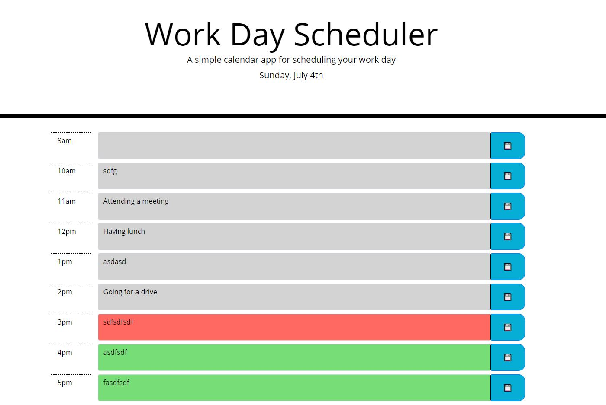

# HomeworkFive

https://lukert-uwa.github.io/HomeworkFive/

## Criteria

Daily planner made with Javascript, Jquery, Bootstrap and Moment.

Today's date displayed at top of page pulled from Moment.

Textarea input is saved to local storage on save button press and returned on page refresh. 

Textarea background class set based upon time of day (past, present future).